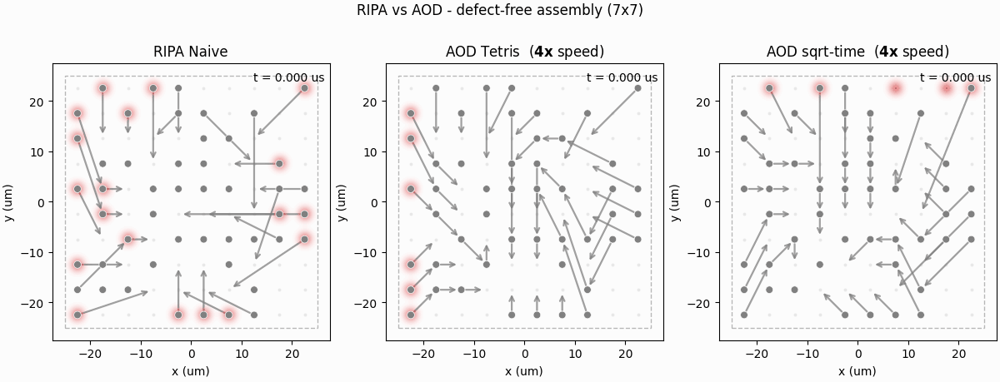
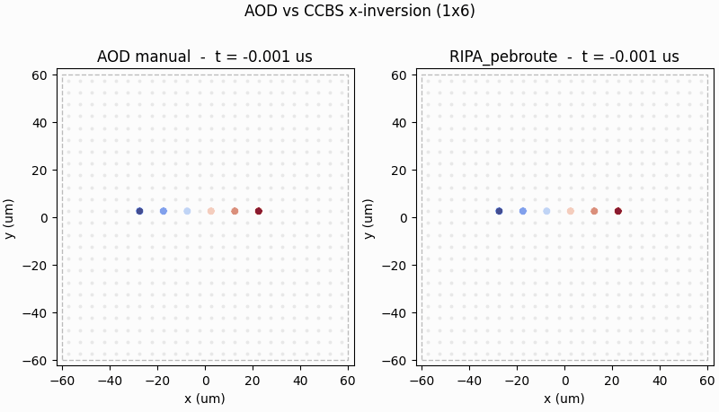
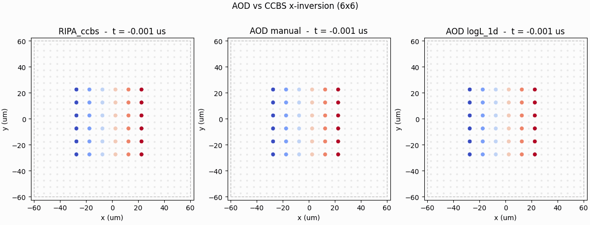
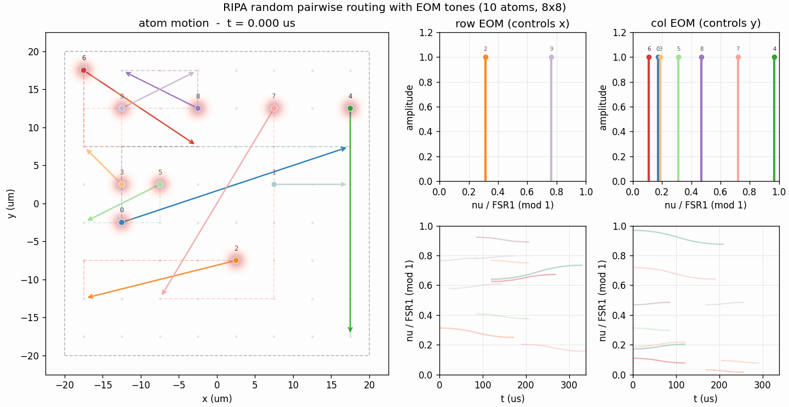

# aod_vs_ripa

A direct comparison of two tools for moving neutral atoms in reconfigurable atom arrays:

- **AOD** (Acousto-Optic Deflector) - the traditional tool that moves atoms in a grid geometry configuration.
- **RIPA** (Re-imaging Phased Array) - a fast SLM proposed in [arXiv:2601.08906](https://arxiv.org/abs/2601.08906) that can move atoms in arbitrary patterns.

**What is so different about a RIPA ?**
- It can move atoms independently in an arbitrary pattern (continuously along the cartesian grid).
- It can be scheduled asynchronously.

For detailed comparison, see [aod_vs_ripa.md](doc/aod_vs_ripa.md)

### (Unlabeled) Identical atom routing

Routing identical atoms, for example, in the case of assembling a defect-free array, is a good example to compare the two tools.

**Defect-free array assembly**

The RIPA scheduler (left) used here is a simple heuristic scheduler [`RIPAPebbleAdvScheduler`](./src/scheduler/ripa_pebble_adv.py). We choose two AOD schedulers to compare with, one is the [Tetris](https://journals.aps.org/prapplied/abstract/10.1103/PhysRevApplied.19.054032) (middle) suitable for stochastic reservoir loading with postselection; and the other one is a [Sqrt-time](https://arxiv.org/pdf/2604.05317v1) (right) that fully utilizes the parallelism of the AOD to solve an arbitrary binary-grid reconfiguration problem.

The RIPA completes the assembly within `497 us`, while both aod schedulers compiles to `~2ms` operation times.

## (Labeled) Pair-wise atom routing

When routing atoms encoded with quantum information, they are no longer treated as identical, and the routing is a labeled, pair-wise rearrangement problem.

**Atom array inversion**

Here we represent an inversion operation of a `1x6` atom array. We can see the RIPA arranger (left) can perform the inversion in a 1-step fashion, while the AOD arranger (middle, right) needs to perform this in multiple steps. Moreover, RIPA does not require a hand-off between AOD and SLM traps which could potentially introduce atom loss.

The performance boost (`2159 us` to `451 us`) is huge.

Note: for AOD it has a `log(N)` arbitrary re-arrangement algorith (and so does RIPA!), as demonstrated in the middle panel. See the original paper [constant_overhead_paper](https://www.nature.com/articles/s41567-024-02479-z) and the code [algorithm here](src/scheduler/logL_1d/logL_1d.py).

With a 6x6 atom array, where AOD arranger (middle, right) gains more parallelism, now the total time cost to rearrange is limited by the maximum throughput. We can see the RIPA scheduler (left) still takes less time due to its flexible routing capability.

**Coding rotation**

## How does a RIPA transportation work

- Continuous frequency sweeps move spots smoothly along either a row or a column.
- Using frequency- or polarization- multiplexing to replicate the primary channel (row channel, continuously moving along x) and rotate it by 90 deg, so that the second channel (col channel) continuously moves along y.
- The EOM RF drive switches each channel on/off independently, and they can be simultaneously on, they can have independent timing for multiple frequency tones (so does multiple tweezer traps).
- To move an atom A → B: pick up atom from A, transport continuously along row/column. **At the intersection of row/column (i.e., at integer grid point (i,j))**, hand-off from one channel to the other. After several row(column)-continuous transport, the atom reaches B.

## How to design a good RIPA scheduler
RIPA scheduling is a very hard problem, mostly in its vast parameter space and its asynchronous nature. This repo implements some heuristic algorithms, as well as a searching algorithm, see [scheduler/readme.md](src/scheduler/readme.md).

The RIPA scheduler, in its geometric nature, is similar to the pebble motion problem, see [Pebble Problem](doc/pebble_problem.md). We also adapted some path-planning algorithms like [Continuous-CBS](https://github.com/PathPlanning/Continuous-CBS).

Different schedulers will yield different total arrangement times. See [inversion 6x6 benchmark](demo/inversion_6x6_benchmark.gif)

## Understanding this repository
- `src/`: source code, see [src/readme.md](src/readme.md).
- `src/scheduler/`: contains the scheduling algorithms, see [scheduler/readme.md](src/scheduler/readme.md).
- `example/`: example scripts to demonstrate the scheduling and to do benchmarking.